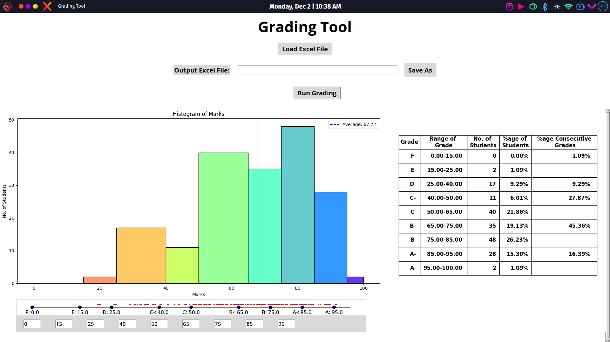

# Automated Grading Tool

## Overview
The Automated Grading Tool is an interactive application designed for educators to dynamically grade students' performance based on customizable criteria. With visualizations and statistical summaries, this tool simplifies the grading process, making it both efficient and transparent.

### Screenshot Sample for Automated Grading Tool

Screenshot of the Automated Grading Tool interface, showcasing features such as grade distribution, histogram of marks, average score, and a detailed grading table. The tool processes input from Excel files to generate insightful grading analytics and summaries.

## Features:-
**Interactive Grading Tool: Allows users to load student marks from an Excel file and dynamically assign grade ranges using adjustable sliders.
**Customizable Grade Ranges: Users can manually set or adjust grade boundaries and view their impact in real time.
**Visualizations: Displays a histogram of student marks with color-coded bins and an average mark line.
**Statistical Summary: Generates a table showing the range of grades, number of students in each range, percentage distribution, and consecutive grade statistics.
**Save and Export: Allows graded data to be exported as an Excel file.
**Responsive UI: A clean, user-friendly interface using Tkinter with scrollable frames for easy navigation.
**Dynamic Updates: Automatically updates visualizations and statistics when grade ranges are adjusted.

## Prerequisites:-
Python Version: Python 3.7 or higher
Required Libraries:
tkinter (Pre-installed with Python)
pandas
matplotlib
numpy
openpyxl (For handling Excel files)

## Installation
1. **Clone the Repository:**
   **git clone https://github.com/premkumaranubhav123/Automated-Grading-Tool
   **cd Automated-Geading-Tool
2.Install Dependencies:
  **pip install -r requirements.txt

## Run the Application
1. Launch the Application: python grading_tool.py
2. How to Use:
**Click Load Excel File to upload a marks sheet (ensure it contains a "Marks" column).
**Adjust sliders to set grade boundaries.
**Click Run Grading to calculate grades.
**Save the output file by specifying a file name in the Save As section.

## Project Structure:-
Automated-Gading_Tool/
├── grading_tool.py       # Main application script
├── requirements.txt      # Dependencies for the project
├── README.md             # Documentation file
└── Marks For Grading.xlsx # Include sample Excel files.
## License 
This project is licensed under the MIT License.

